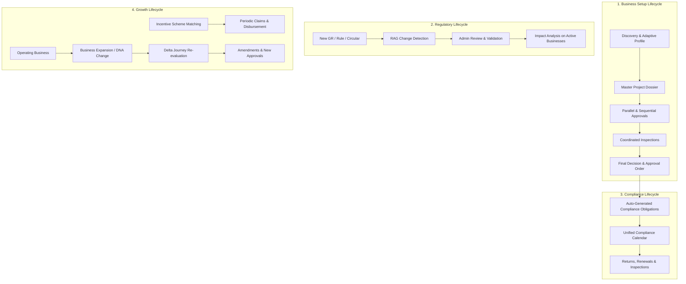

# EKATMA Department Portal — Sidebar Tab UX & Workflow Audit

This document provides a comprehensive tab-by-tab analysis of the EKATMA Department Portal, detailing the intended user experience, actual implementation flow, and logical inconsistencies identified with respect to the master specification in **`Full Workflow (1).pdf`**.

---

## 1. System Overview & The 4 Master Lifecycles

According to **`Full Workflow (1).pdf`**, EKATMA is not merely an isolated approval portal. It orchestrates **four connected lifecycles**:

Running continuously throughout all lifecycles are nine cross-cutting engines:
1. **Master Data & Verified Provenance Layer** (single source of truth with audit timestamps).
2. **Document Reuse & Pre-validation Engine** (no duplicate uploads, automated expiry checks).
3. **Cross-Form Consistency Engine** (cross-department numeric and attribute reconciliation).
4. **Desk-by-Desk SLA & Escalation Engine** (tracking active hold vs. department time).
5. **Risk-Based Scrutiny Router** (Standard, Enhanced, Inspection-heavy routes).
6. **Consolidated Query Engine (M18)** (one unified query round, avoiding piecemeal queries).
7. **Delta Re-Scrutiny Engine (M20)** (re-reviewing only modified and dependency-impacted fields).
8. **Joint Inspection Planning Engine (M21–M24)** (synchronized site visits across agencies).
9. **Officer Regulatory RAG Assistant (M32)** (grounded legal justifications, bilingual GR lookup).

---

## 2. Tab-by-Tab UX Flow & Inconsistency Audit

Below is the detailed audit of each of the 16 sidebar tabs configured in the Department Portal shell.

---

### Tab 1: Department Home (`dept-home`)
- **Route**: `/department`
- **Modules Covered**: M01 / Department Overview & Command Centre
- **Intended UX Flow**:
  1. Officer logs in and lands on the Department Command Centre.
  2. Displays real-time operational posture:
     - Applications requiring immediate action (SLA approaching/breached).
     - Breakdown of incoming applications by stage (Scrutiny, Query pending, Inspection, Decision).
     - Inspection schedule snapshot for the day/week.
     - Regulatory change alerts needing officer attention.
  3. Clicking any metric card or high-priority item jumps directly into that specific worklist or application context.
- **Current Implementation**:
  - Displays summary statistics, urgent action list, SLA risk breakdown, and quick bottleneck stats.
  - Clicking application rows correctly routes to `/department/applications/[appId]`.
- **Logical Inconsistencies vs Master Flow**:
  - **Inconsistency 1.1 — Static Aggregations**: The dashboard displays mock stats that are not dynamically aggregated from the actual `APPLICATION_CONTEXTS` records.
  - **Inconsistency 1.2 — Missing Lifecycle Indicators**: The dashboard focuses solely on "pre-approval" stage applications, completely ignoring active Compliance monitoring (Lifecycle 3) and Regulatory Changes (Lifecycle 2), which are core components of the master flow.

---

### Tab 2: My Queue (`dept-queue`)
- **Route**: `/department/queue`
- **Modules Covered**: M02 Application Queue / Inbox
- **Intended UX Flow**:
  1. Serves as the officer's personal worklist segmented by status: All, New, In Scrutiny, Query Raised, Resubmitted, Inspection, Ready for Decision.
  2. Shows desk assignment, SLA elapsed vs remaining, risk category (Standard vs Enhanced), and payment status.
  3. Clicking "Review" or the Application ID opens the single application workspace with the active tab corresponding to that application's current desk.
- **Current Implementation**:
  - Displays filterable table with tabs (All, New, Scrutiny, Query Raised, etc.).
  - Clicking opens `/department/applications/[appId]`.
- **Logical Inconsistencies vs Master Flow**:
  - **Inconsistency 2.1 — Blind Tab Default**: Clicking an application in "Query Raised" or "Inspection Pending" always lands on `tab=overview` instead of deep-linking to the active desk (e.g. `?tab=queries` or `?tab=inspections`), requiring extra officer clicks.
  - **Inconsistency 2.2 — Missing Risk Tier**: The queue table displays service and desk, but fails to show the Risk Tier (Standard vs Enhanced Scrutiny), which the master flow specifies as the key deterministic router for officer workload.

---

### Tab 3: Applications (`dept-apps`)
- **Route**: `/department/search` & `/department/applications/[applicationId]`
- **Modules Covered**: M03/M04 Application Search & Directory, M06 Application Master Overview, M07 Business DNA, M08 Timeline, M09 Automated Pre-Check
- **Intended UX Flow**:
  1. Department-wide directory and global lookup across all applications (past, present, across all desks).
  2. Search by Application ID, Business Name, Service, Plot Number, or Region.
  3. Selecting an application opens the **Application Master Record (M06)**, which acts as the unified anchor for:
     - **Business DNA Snapshot (M07)**: Master company profile with verified data provenance.
     - **Lifecycle Timeline (M08)**: End-to-end chronological audit trail of all state transitions.
     - **Automated Pre-Check Summary (M09)**: Completeness, format, and cross-form mismatch flags prior to human scrutiny.
- **Current Implementation**:
  - Search page enables query-based filtering and opens `/department/applications/[appId]`.
  - Application view provides sub-pages for DNA, Timeline, and Pre-check.
- **Logical Inconsistencies vs Master Flow**:
  - **Inconsistency 3.1 — Provenance Visualisation Missing**: The master flow specifies that every data field in the Business DNA must display its source (e.g., "MIDC allotment doc", "Self-declared"), issue date, expiry date, and verification status. Currently, M07 shows fields but lacks the interactive provenance badges.
  - **Inconsistency 3.2 — Pre-Check Isolation**: M09 Pre-check runs independently but does not automatically flag blockers to prevent an officer from proceeding if mandatory prerequisites are missing.

---

### Tab 4: Service Catalogue (`dept-catalogue`)
- **Route**: `/department/services`
- **Modules Covered**: M05 Service Catalogue & Queue Segmentation
- **Intended UX Flow**:
  1. Displays the department's configured statutory services (e.g., Land Allotment, Building Plan Approval, Water Connection, Drainage NOC, Fire NOC).
  2. For each service, provides:
     - Statutory SLA limit.
     - Active caseload and pending queue breakdown.
     - Prerequisite checklist and dependent upstream/downstream services.
  3. Clicking "View Queue" filters the main queue to that specific service.
- **Current Implementation**:
  - Cards for services showing backlog count and SLA. Clicking a service navigates to `/department/queue?service=...`.
- **Logical Inconsistencies vs Master Flow**:
  - **Inconsistency 4.1 — Parallel vs Sequential Dependency Omission**: The master flow highlights which services can run in parallel (e.g., Water + Power + Provisional Fire) vs sequential (Land Approval -> Building Plan). The Service Catalogue currently displays services in a flat list without visualising execution dependencies.

---

### Tab 5: Inspection Queue (`dept-insp-queue`)
- **Route**: `/department/inspection-queue`
- **Modules Covered**: M21 Inspection Queue Management & Joint Scheduling
- **Intended UX Flow**:
  1. Dedicated operational desk for scheduling and coordinating on-site visits.
  2. Identifies inspection candidates across departments (MIDC Engineering, DISH Safety, Fire, MPCB).
  3. **Joint Coordination Algorithm**: Identifies applications requiring visits from multiple agencies and provides tools to schedule a **single, common joint inspection** rather than separate visits.
  4. Allows selecting an inspector, date, time window, and publishing the joint notice to the entrepreneur.
- **Current Implementation**:
  - Renders M21 Inspection Queue with status filters (Scheduled, Completed, Re-inspection, Awaiting Coordination).
  - Clicking an item routes to M22 Inspection Planning (`/inspections/[inspectionId]/plan`).
- **Logical Inconsistencies vs Master Flow**:
  - **Inconsistency 5.1 — Disconnect with Tab 7 (Inspections)**: There are two adjacent sidebar tabs: "Inspection Queue" and "Inspections". This creates cognitive confusion. According to the master flow, "Queue" is the scheduling desk, whereas "Inspections" is the actual field report/observation evaluation desk. Currently, their boundary is blurred.
  - **Inconsistency 5.2 — Joint Coordination Mock**: The "Awaiting Coordination" filter is present, but clicking it does not offer a joint calendar interface across departments (MIDC + Fire + MPCB) as outlined in Page 19 of the master flow.

---

### Tab 6: Scrutiny (`dept-scrutiny`)
- **Route**: `/department/scrutiny`
- **Modules Covered**: M10 Scrutiny Route Explainability, M11 Scrutiny Workbench, M12 Parameter Review, M13 Document Review, M14 Building Scrutiny, M15 Water Utility Scrutiny, M16 Cross-Form Consistency, M17 Regulatory Dependency Graph, M20 Delta Re-Scrutiny
- **Intended UX Flow**:
  1. The central operational workbench for evaluating an application.
  2. First displays the **Scrutiny Worklist** (applications in Document Scrutiny, Technical Scrutiny, or Resubmitted).
  3. Upon opening an application:
     - **M10**: Explains why the application was routed to Standard vs Enhanced Scrutiny.
     - **M11/M14/M15**: Parameter-by-parameter examination (valid, query, invalid).
     - **M13**: Document inspection with side-by-side verification and expiry checks.
     - **M16**: Cross-form consistency check (verifying matching parameters across MIDC, Fire, and MPCB submissions).
     - **M17**: Upstream and downstream dependency tree.
     - **M20 (Delta Re-Scrutiny)**: On resubmission, shows *only* changed fields and downstream affected parameters, avoiding full re-scrutiny.
- **Current Implementation**:
  - Route `/department/scrutiny` renders `ScrutinyCommandCentre` with recent activities and direct links to M10–M17.
- **Logical Inconsistencies vs Master Flow**:
  - **Inconsistency 6.1 — Direct Query Dispatch Disallowed**: In some scrutiny screens (M11, M14), officers can click "Add to Consolidated Query", but the link between parameter-level defects and the final consolidated query memo is disconnected in state.
  - **Inconsistency 6.2 — Delta Re-Scrutiny Placement**: Delta re-scrutiny (M20) is placed inside Scrutiny, but when an entrepreneur resubmits, the notification previously routed to the Queries tab instead of M20.

---

### Tab 7: Inspections (`dept-inspect`)
- **Route**: `/department/inspections`
- **Modules Covered**: M23 Inspection Workspace, M24 Observations & Re-inspection
- **Intended UX Flow**:
  1. Review recorded on-site inspection findings, photo uploads, geo-tags, and officer checklists.
  2. Evaluate site compliance: Pass, Observation (Correction Required), or Non-Compliant.
  3. If Observation: Generates punch-list for the entrepreneur with a cure period.
  4. If Non-Compliant: Triggers re-inspection scheduling or escalates to Final Decision for rejection.
- **Current Implementation**:
  - Currently renders `InspectionRecords` or redirects to M23/M24 for specific applications.
- **Logical Inconsistencies vs Master Flow**:
  - **Inconsistency 7.1 — Duplicate Route Confusion**: Having `/department/inspection-queue` and `/department/inspections` as separate top-level sidebar items is redundant. The master flow treats Inspection as a single 3-step engine: `Queue / Plan` -> `Site Execution` -> `Observations / Punch-list`.

---

### Tab 8: Queries / Deficiencies (`dept-queries`)
- **Route**: `/department/queries`
- **Modules Covered**: M18 Consolidated Query Builder, M19 Query & Response History
- **Intended UX Flow**:
  1. **Strictly enforces the "Single Consolidated Query" principle** from Page 17–18 of `Full Workflow (1).pdf`:
     - Officers are **strictly forbidden** from raising piecemeal queries (Query 1 -> Reply -> Query 2 -> Reply).
     - All deficiencies discovered during Document Review, Technical Scrutiny, and Cross-Form Consistency accumulate into a consolidated staging tray.
  2. Opening the Queries tab displays the **Query Worklist** (applications with draft queries or awaiting entrepreneur reply).
  3. Selecting an application opens **M18 Query Builder**:
     - Consolidates all flagged parameter defects, missing documents, and explanations into one official memo.
     - Officer reviews and signs off on the single consolidated query memo.
  4. Once sent, application moves to `QUERY_RAISED` state (SLA timer pauses or splits into applicant-hold time).
  5. **M19 Query History**: Provides an immutable audit trail of past queries, entrepreneur responses, and resubmitted evidence.
  6. Resubmission unlocks **M20 Delta Re-Scrutiny**.
- **Current Implementation**:
  - Route `/department/queries` now opens `QueryWorklist`.
  - Clicking an application launches M18 Query Builder.
  - M18 links seamlessly to M19 Query History.
- **Logical Inconsistencies vs Master Flow**:
  - **Inconsistency 8.1 — Unlinked Staging Tray**: Candidates in M18 are currently static mock items (`M18_CANDIDATES`) rather than dynamically receiving defects marked as "Query" in M11/M14/M15 Scrutiny.
  - **Inconsistency 8.2 — Transition to Delta Scrutiny**: From M19 Query History, when an officer verifies that all query responses are received, the primary CTA should be "Proceed to Delta Re-Scrutiny (M20)". Currently, M19 has a button, but it is secondary and does not update the application state.

---

### Tab 9: Decisions (`dept-decisions`)
- **Route**: `/department/decisions`
- **Modules Covered**: M25 Final Decision Workspace, M26 Formal Decision Record, M27 Post-Decision Dependency Update, M28 Post-Decision Conditions & Compliance, M29 Amendment Intake
- **Intended UX Flow**:
  1. Terminal stage of the approval journey (Pages 20–22 of `Full Workflow (1).pdf`).
  2. Displays applications in `FINAL_DECISION` state.
  3. **M25 Decision Workspace**:
     - Final review of all prerequisite approvals, scrutiny findings, and inspection clearances.
     - Senior Officer selects: **Approve**, **Correction Required (Rework)**, or **Reject**.
  4. If **Approve**:
     - **M26 Decision Record**: Generates digitally signed statutory approval order, certificate ID, issue date, and validity.
     - **M27 Dependency Update**: Updates the master dependency graph, automatically unlocking downstream services (e.g. Building Plan approval unlocks Fire NOC and Water Connection).
     - **M28 Auto-Generate Compliance Obligations**: Automatically converts approval conditions into recurring compliance tasks (e.g., quarterly effluent reports, annual fire renewals).
  5. If **Reject**: Issues formal rejection order with statutory appeal guidance.
- **Current Implementation**:
  - `/department/decisions` renders `DecisionsDashboard`.
  - Deep-links to M25, M26, M27, M28, M29.
- **Logical Inconsistencies vs Master Flow**:
  - **Inconsistency 9.1 — Compliance Engine Decoupling**: In the master flow, M28 is the bridge to Lifecycle 3 (Operating Compliance). Currently, M28 generates static conditions (`COND-001`) that do not populate into a unified compliance calendar.
  - **Inconsistency 9.2 — Dependency Propagation Simulation**: M27 shows sync events, but does not actually mutate the dependency graph state of downstream mock nodes.

---

### Tab 10: SLA & Escalations (`dept-sla`)
- **Route**: `/department/sla`
- **Modules Covered**: M30 SLA Performance & Escalation Management
- **Intended UX Flow**:
  1. Department-wide real-time tracking of statutory timelines.
  2. Tracks dual timers (Page 27 of `Full Workflow (1).pdf`):
     - **Department Processing Time**: Time the file spent on officer desks.
     - **Applicant Hold Time**: Time paused while waiting for query resolution.
  3. Highlights SLA status: Normal, Approaching Deadline (Yellow Warning), Breached (Red Escalation).
  4. Escalates breached applications automatically to higher nodal officers.
- **Current Implementation**:
  - Displays SLA performance cards, aging buckets, risk rows, and allows filtering by service.
- **Logical Inconsistencies vs Master Flow**:
  - **Inconsistency 10.1 — Single Timer Display**: The UI displays total elapsed days, but fails to show the split between "Department Active Time" and "Applicant Response Time", which is essential under Maharashtra Right to Services rules to avoid penalising officers for entrepreneur delays.

---

### Tab 11: Grievances (`dept-grievances`)
- **Route**: `/department/grievances`
- **Modules Covered**: M31 Citizen / Entrepreneur Grievance Redressal
- **Intended UX Flow**:
  1. Tracks formal grievances filed by entrepreneurs (Page 28 of `Full Workflow (1).pdf`).
  2. Every grievance is **strictly application-linked**: automatically attaches Application ID, current desk, officer notes, query history, and SLA logs.
  3. Officer can review grievance causes (e.g., "Unreasonable query round", "SLA delay"), add response, and issue hearing notices or expedited clearance orders.
- **Current Implementation**:
  - Renders split view of grievances with status chips and response input.
- **Logical Inconsistencies vs Master Flow**:
  - **Inconsistency 11.1 — Standalone Grievances**: Grievances in M31 currently behave like generic support tickets rather than auto-populating full application telemetry (submission date, current desk, query round count) directly from the application store.

---

### Tab 12: Regulatory Assistant (`dept-regasst`)
- **Route**: `/department/regasst`
- **Modules Covered**: M32 Officer Regulatory RAG & Bilingual Intelligence
- **Intended UX Flow**:
  1. AI-powered assistant for officers during scrutiny (Page 28–29 of `Full Workflow (1).pdf`).
  2. Answers legal and regulatory questions:
     - "Which GR specifies the setback requirements for plot area > 4000 m²?"
     - "Has the effluent treatment threshold changed in 2026?"
     - "Explain clause 14.2 in Marathi."
  3. Grounded strictly in official Maharashtra GRs, circulars, and departmental acts (Neo4j knowledge graph + semantic retrieval).
  4. Returns exact citations, clauses, and effective dates.
- **Current Implementation**:
  - Interactive chat interface with pre-seeded query chips, Marathi translation toggles, and citation links.
- **Logical Inconsistencies vs Master Flow**:
  - **Inconsistency 12.1 — Lack of Scrutiny Context Injection**: When an officer launches the Regulatory Assistant from inside an application's scrutiny screen (via top context bar), the assistant does not auto-ingest the active application's sector, location, or parameters as contextual prompt grounding.

---

### Tab 13: Analytics (`dept-analytics`)
- **Route**: `/department/analytics` & `/department/bottleneck`
- **Modules Covered**: M34 Executive Analytics, M35 Funnel Analysis, M36 Causal Bottleneck Analytics
- **Intended UX Flow**:
  1. Department-level process mining and causal delay discovery (Pages 29–30 of `Full Workflow (1).pdf`).
  2. Goes beyond simple counts ("500 applications pending") to reveal root causes:
     - Stage breakdown: e.g., "Inspection scheduling causes 27% of total delays".
     - Repetitive queries: e.g., "Water-balance calculation errors occur in 28% of MPCB cases".
     - Geospatial hotspots: identifying regional offices with backlog bottlenecks.
- **Current Implementation**:
  - Detailed analytics dashboard with charts, stage breakdown, conversion funnels, and causal bottleneck analysis.
- **Logical Inconsistencies vs Master Flow**:
  - **Inconsistency 13.1 — Actionable Feedback Loop Missing**: Identifies that "Site Plan Issues cause 21% of correction requests", but offers no direct action button to update pre-validation rules (M09) or documentation guidance (M14) to prevent future occurrences.

---

### Tab 14: Regulatory Changes (`dept-regchng`)
- **Route**: `/department/regchng` & `/department/regchng/impact`
- **Modules Covered**: M33 Regulatory Change Detection & Business Impact Simulator
- **Intended UX Flow**:
  1. Embodies Lifecycle 2 of the master specification (Pages 23–24 of `Full Workflow (1).pdf`).
  2. Detects new Government Resolutions (GRs), acts, and circulars via RAG ingestion.
  3. Regulatory Admin reviews the detected change, approves or edits the modified rule, and publishes it.
  4. **Impact Analysis Engine**: Automatically calculates the ripple effect on:
     - Active applications currently under review.
     - Operating businesses requiring updated compliance/renewals.
     - Upcoming inspection procedures.
  5. Broadcasts automated notices to affected entrepreneurs and officers.
- **Current Implementation**:
  - Renders M33 Regulatory Changes feed and M33 Impact Simulator showing affected applications and businesses.
- **Logical Inconsistencies vs Master Flow**:
  - **Inconsistency 14.1 — Missing Rule Publication Flow**: Shows the list of detected changes, but lacks the admin interface to "Confirm & Publish New Rule", which according to Page 23 is required before running the impact simulation.

---

### Tab 15: Workload (`dept-workload`)
- **Route**: `/department/workload`
- **Modules Covered**: M37 Officer & Desk Workload Balancing
- **Intended UX Flow**:
  1. Managerial oversight of desk distribution and capacity.
  2. Displays caseload per officer, average turnaround time, and backlog distribution.
  3. Rebalancing controls: reassigning applications from overloaded desks to available officers.
- **Current Implementation**:
  - Displays officer workload distribution table and rebalance metrics.
- **Logical Inconsistencies vs Master Flow**:
  - **Inconsistency 15.1 — Reassignment Mutation**: Reassigning an application updates the display in M37, but does not reflect on the assigned officer name in Tab 2 (`My Queue`) or Tab 6 (`Scrutiny`).

---

### Tab 16: Audit / History (`dept-audit`)
- **Route**: `/department/audit`
- **Modules Covered**: M38 Department-Wide Tamper-Evident Audit Trail
- **Intended UX Flow**:
  1. Chronological log of all administrative and statutory actions across the department.
  2. Records officer decisions, query dispatch, inspection reports, SLA overrides, and role-based permissions.
  3. Filterable by date range, action type, officer ID, and application ID.
- **Current Implementation**:
  - Filterable audit trail table with event details, timestamps, and hash signatures.
- **Logical Inconsistencies vs Master Flow**:
  - **Inconsistency 16.1 — Global vs Application Scoped Audit**: The department-wide audit log exists, but when viewing an individual application under Tab 3 (`Applications > [appId] > Audit`), it displays the exact same global records rather than scoping strictly to events for that specific application.

---

## 3. High-Priority Systemic Inconsistencies to Resolve

| Priority | Issue Area | Description | Recommended Resolution |
| :--- | :--- | :--- | :--- |
| **P0** | **Inspection Tab Redundancy** | Tabs `Inspection Queue` (Tab 5) and `Inspections` (Tab 7) compete for the same lifecycle. | Consolidate or strictly delineate: `Inspection Queue` = Scheduling & Joint Coordination; `Inspections` = Field Workspace, Checklists & Observation Punch-lists. |
| **P0** | **Query Staging Integration** | Parameter defects flagged during Scrutiny (M11/M14) do not automatically populate M18 Query Builder candidates. | Connect Scrutiny state to M18 so clicking "Flag Deficiency" in scrutiny dynamically populates the Consolidated Query draft. |
| **P0** | **Resubmission -> Delta Scrutiny Link** | When an entrepreneur resubmits, officers must be routed directly to M20 Delta Re-Scrutiny, not full scrutiny. | Update resubmitted application action in Queue and Overview to launch M20 Delta Scrutiny directly. |
| **P1** | **Decision to Compliance Hand-off** | M28 (Post-Decision Compliance) exists as a static screen and does not flow into a department-wide compliance monitor. | Connect M28 conditions to an ongoing monitoring view so approved applications transition into Lifecycle 3. |
| **P1** | **Regulatory Impact Trigger** | Regulatory Changes (M33) should show an alert badge on affected applications in `My Queue`. | Inject a "Regulatory Change Impacted" warning chip into the application row in Tab 2 when affected by a new GR. |
| **P2** | **Bilingual RAG Context Grounding** | M32 Regulatory Assistant opens as a blank chat without knowing which application the officer was reviewing. | Pass `applicationId` and current scrutiny section as initial context to M32 when opened from the context bar. |

---

## 4. Summary

This audit establishes the baseline for aligning the EKATMA Next.js Department Portal with the master specification in **`Full Workflow (1).pdf`**. Resolving these systemic inconsistencies will complete the transformation of EKATMA from a prototype viewer into an intelligent, end-to-end regulatory and industrial compliance engine.
