# EKATMA MIDC Department Portal — `flow.md`

## Purpose

This document defines **only the navigation and page-to-page connections** for the MIDC Department Portal.

It is intended to be given to another ChatGPT/Figma prompt generator so that it can implement the correct connections without creating redundant navigation, cyclic paths, or multiple routes to the same deep workflow.

The key rule is:

> **Global sidebar tabs are work areas. Application Workspace tabs are operations on one application. Deep workflow pages should not be exposed as parallel shortcuts from multiple unrelated tabs.**

---

# 1. Global Sidebar

The main MIDC Department sidebar contains:

1. Department Home
2. My Queue
3. Applications
4. Service Catalogue
5. Inspection Queue
6. Scrutiny
7. Inspections
8. Queries / Deficiencies
9. Decisions
10. SLA & Escalations
11. Grievances
12. Regulatory Assistant
13. Analytics
14. Regulatory Changes
15. Workload
16. Audit / History

---

# 2. Overall Navigation Flow

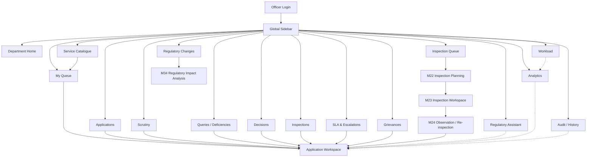

---

# 3. Critical Navigation Principle

There should be **one canonical route into the application-specific workflow**:

```text
Any application-related global tab
        ↓
Application Workspace
        ↓
Relevant Application Workspace tab
        ↓
Specific page
```

For example:

```text
My Queue
   ↓
Application
   ↓
Scrutiny
   ↓
Land / Plot Scrutiny
```

NOT:

```text
My Queue
   ↓
Land / Plot Scrutiny
```

And NOT:

```text
My Queue
   ↓
Application
   ↓
Land / Plot Scrutiny

Scrutiny
   ↓
Land / Plot Scrutiny
```

The second route is redundant.

The global **Scrutiny** tab should lead to the Scrutiny work area and then to the selected application. The actual service-specific scrutiny happens inside that application's Scrutiny tab.

---

# 4. Department Home

## Purpose

Operational command centre.

## What is present

- KPI summary
- My Actions
- SLA Risk
- Inspection Queue
- Current Process Insights
- Workload
- Service Mix

## Connections

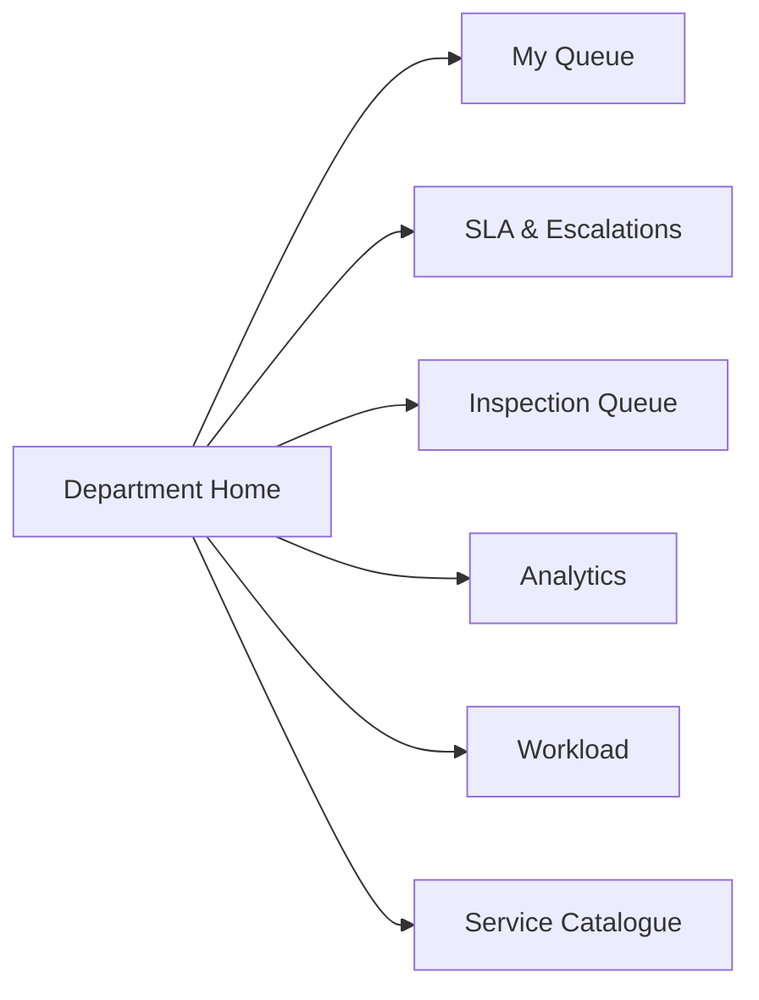

## Do NOT connect Home directly to

- Land / Plot Scrutiny
- Building / Planning Scrutiny
- Water / Utility Scrutiny
- Query Builder
- Delta Re-scrutiny
- Decision Workspace
- Dependency Update
- Compliance

Home only directs the officer to the appropriate **work area**.

---

# 5. My Queue

## Purpose

Applications and actions currently requiring attention within the officer's permitted scope.

## What is present

- Application list
- Current state
- Service
- Project stage
- Current desk
- SLA
- Scrutiny route
- Dependency state
- Action required

## Connection

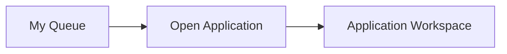

## Important

My Queue must NOT directly connect to:

- Land / Plot Scrutiny
- Building / Planning Scrutiny
- Water / Utility Scrutiny
- Documents
- Queries
- Delta Review
- Decision Workspace
- Inspection Workspace

The queue only identifies the application requiring action.

---

# 6. Applications / Application Search

## Purpose

**Application Search is ONLY for finding an application.**

It is not a workflow dashboard.

## What is present

Search and filtering by:

- Application ID
- Business
- Applicant
- MIDC Service
- Project Stage
- Location
- MIDC Estate
- Plot
- Status
- Date
- Approval / Order number

## Connection

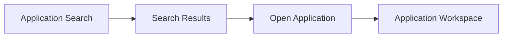

## Important

Application Search must NOT have separate shortcuts to:

- Scrutiny
- Queries
- Inspections
- Decisions
- Documents
- Land / Plot
- Building / Planning
- Water / Utility

Search finds the application.

The Application Workspace handles everything else.

---

# 7. Service Catalogue

## Purpose

View MIDC service categories and their operational queue state.

## What is present

Service groups such as:

- Land / Plot
- Building / Planning
- Water / Utility
- Drainage / Infrastructure
- Construction / Follow-up
- Amendment / Modification
- Other Configured Services

## Connection

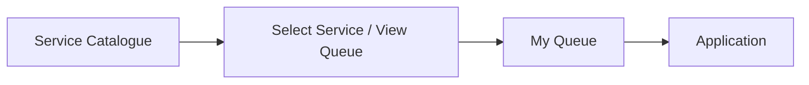

Example:

```text
Service Catalogue
      ↓
Building / Planning
      ↓
View Queue
      ↓
My Queue filtered to Building / Planning
      ↓
Application
```

## Important

Service Catalogue must NOT directly open:

- M11 Land / Plot
- M14 Building / Planning
- M15 Water / Utility
- M18 Query Builder
- M20 Delta Review
- M25 Decision Workspace

It is a service-level queue view, not a workflow launcher.

---

# 8. Scrutiny

## Purpose

Operational work area for applications requiring scrutiny.

## What is present

- New
- In Scrutiny
- Query Required
- Resubmitted
- Delta Review
- Inspection
- SLA Risk

Main table:

- Application
- Business
- Service
- Scrutiny Stage
- Action Required
- Last Updated
- SLA
- Status

## Connection


## Important

The global Scrutiny page should NOT expose separate permanent shortcuts such as:

- Open M09
- Open M10
- Open M11
- Open M14
- Open M15
- Open M16
- Open M17
- Open M20

Those are application-specific scrutiny pages.

The officer first selects the application.

---

# 9. Application Workspace

Every application-related route should converge here.

## Application Workspace tabs

```text
Overview
Business DNA
Application
Documents
Scrutiny
Queries
Inspections
Decision
Dependencies
Timeline
Regulatory Reference
Audit
```

## Connection

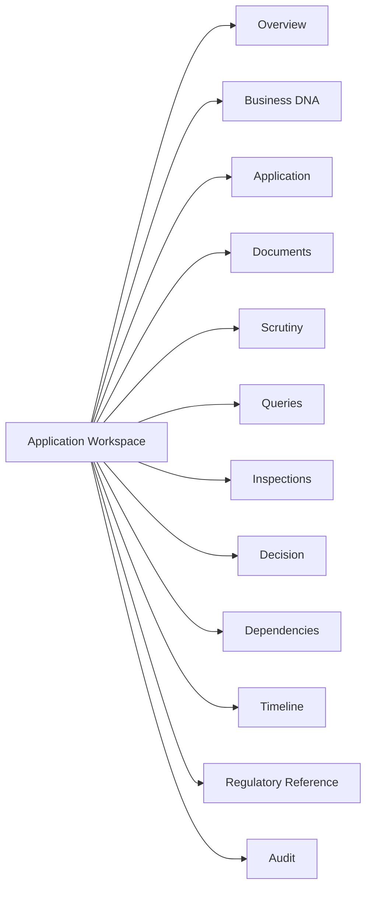

This is the **central application hub**.

---

# 10. Application Workspace → Overview

## Purpose

Summary of the selected application.

## What is present

- Application identity
- Business
- Applicant
- MIDC Service
- Project Stage
- Location
- Estate / Plot
- Current State
- Current Desk
- SLA
- Dependency summary
- Inspection summary
- Decision summary
- Current action

## Connections

Overview can open the application's relevant tabs:

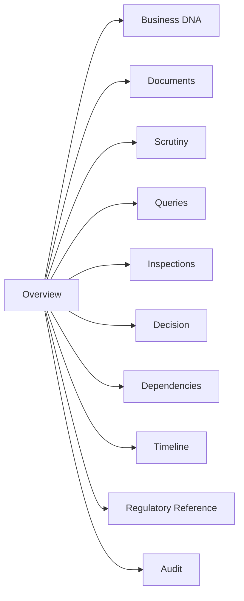

## Important

Overview should not contain a large list of separate deep workflow buttons.

Prefer:

```text
Current Action → Open Scrutiny
```

rather than:

```text
Review Land
Review Building
Review Water
Review Documents
Review Consistency
Review Dependency
Review Delta
```

---

# 11. Application Workspace → Business DNA

## Purpose

View the entrepreneur's Business DNA and its provenance.

## What is present

- Business identity
- Industry / activity
- Project type
- Project stage
- Location
- MIDC estate / plot
- Land
- Scale
- Building
- Utilities
- Environment / safety
- Existing approvals
- Verification state
- Source
- Version
- Changes

## Connections

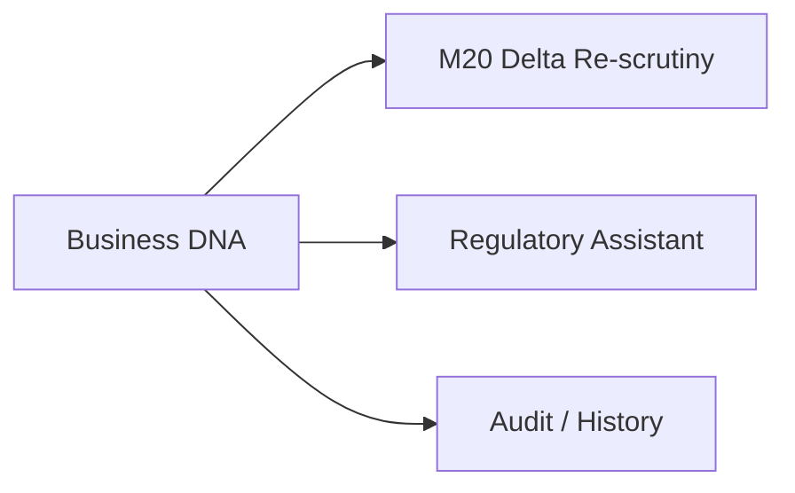

Business DNA does not directly open service-specific scrutiny.

It is context used by scrutiny.

---

# 12. Application Workspace → Application

## Purpose

View the submitted application.

## What is present

- Submitted form
- Application fields
- Declarations
- Payment / challan
- Submission metadata
- Application version
- Submission date
- Current application state
- Previous versions

## Connections

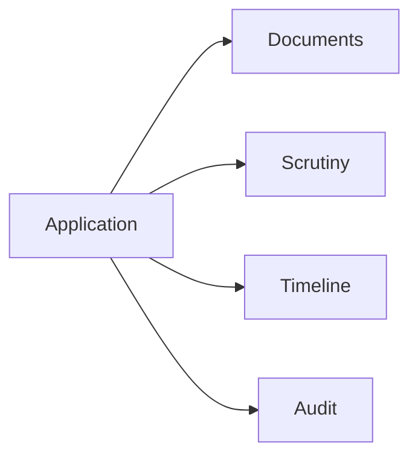

---

# 13. Application Workspace → Documents

## Purpose

Review all application documents and evidence.

## What is present

- Document list
- Document type
- Source
- Issue date
- Expiry
- Verification state
- Version
- Reuse history
- Related requirement

## Connection

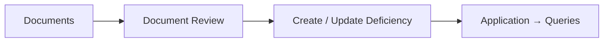

There should be one application-level document review area.

Do NOT create separate global document workflows for Land, Building and Water.

---

# 14. Application Workspace → Scrutiny

This is where the deep scrutiny workflow lives.

## Connection

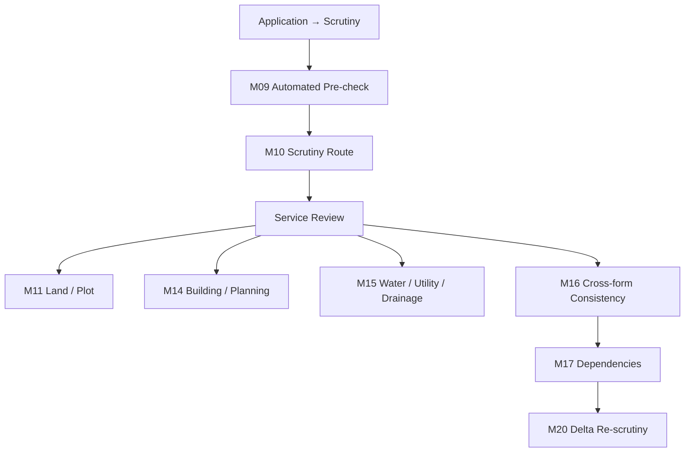

## Service Review rule

Only the relevant configured service review should be shown.

For example:

```text
Land / Plot application
    ↓
Land / Plot Review
```

```text
Building / Planning application
    ↓
Building / Planning Review
```

```text
Water / Utility application
    ↓
Water / Utility Review
```

Do not make the officer navigate through irrelevant service modules.

---

# 15. M09 — Automated Pre-check

## Connection

```text
Application → Scrutiny → Pre-check
```

After reviewing the pre-check:

```text
M09 → M10 Scrutiny Route
```

M09 should not be independently reachable from My Queue, Applications or Service Catalogue.

---

# 16. M10 — Scrutiny Route

## Connection

```text
Application → Scrutiny → Pre-check → Scrutiny Route
```

Then:

```text
M10 → Relevant Service Review
```

Possible service review:

- M11 Land / Plot
- M14 Building / Planning
- M15 Water / Utility / Drainage

Do not create separate global navigation paths to these pages.

---

# 17. M11 / M14 / M15 — Service Scrutiny

These are service-specific pages inside the Application → Scrutiny workflow.

## Connections

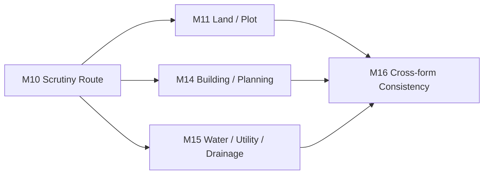

The service review should not loop back to the global Scrutiny tab.

It remains inside the same Application Workspace.

---

# 18. M12 — Parameter Detail

M12 is a detail view within the relevant service scrutiny.

## Connection

```text
Application → Scrutiny → Service Review
                    ↓
              Parameter Detail
```

It should return to the relevant service scrutiny page.

It should NOT create a new global route.

```text
M12 → M11 / relevant service review
```

Not:

```text
M12 → My Queue
M12 → Scrutiny global page
```

---

# 19. M13 — Document Review

M13 is a document review function used by scrutiny.

## Connection

```text
Application
   ↓
Documents
   ↓
Document Review
```

It can be opened when a scrutiny task requires evidence review.

It should return to:

```text
Documents
```

or the originating scrutiny context.

It should not become a separate global navigation item.

---

# 20. M16 — Cross-form Consistency

## Connection

```text
Application
   ↓
Scrutiny
   ↓
Service Review
   ↓
Cross-form Consistency
```

After consistency review:

```text
M16 → M17 Dependencies
```

if dependency review is required.

It may also create a query:

```text
M16 → Query / Deficiency
```

This should open the application's Queries tab.

---

# 21. M17 — Regulatory Dependency View

## Connection

```text
Application
   ↓
Scrutiny
   ↓
Dependencies
```

M17 shows the configured dependency graph.

If a deficiency or prerequisite issue requires entrepreneur action:

```text
M17 → Application → Queries
```

If scrutiny continues:

```text
M17 → Scrutiny workflow
```

M17 must not create a new independent dependency workflow elsewhere.

---

# 22. M20 — Delta Re-scrutiny

## Connection

```text
Resubmission
    ↓
Application
    ↓
Scrutiny
    ↓
Delta Re-scrutiny
```

After delta analysis:

```text
M20 → Relevant changed service review
```

For example:

```text
M20
 ↓
Building / Planning Review
```

or:

```text
M20
 ↓
Land / Plot Review
```

Do not create a new global "Delta" tab.

---

# 23. Queries / Deficiencies — Global Tab

## Purpose

Operational queue of deficiencies and responses.

## What is present

- Open Queries
- Awaiting Entrepreneur
- Responses Received
- Ready to Finalise
- Resubmissions
- Overdue
- SLA Risk

## Connection

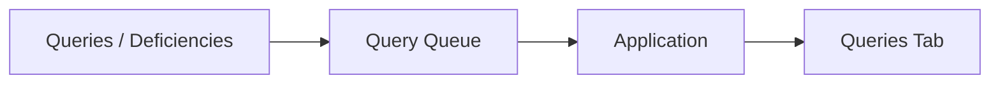

---

# 24. Application Workspace → Queries

## Connection

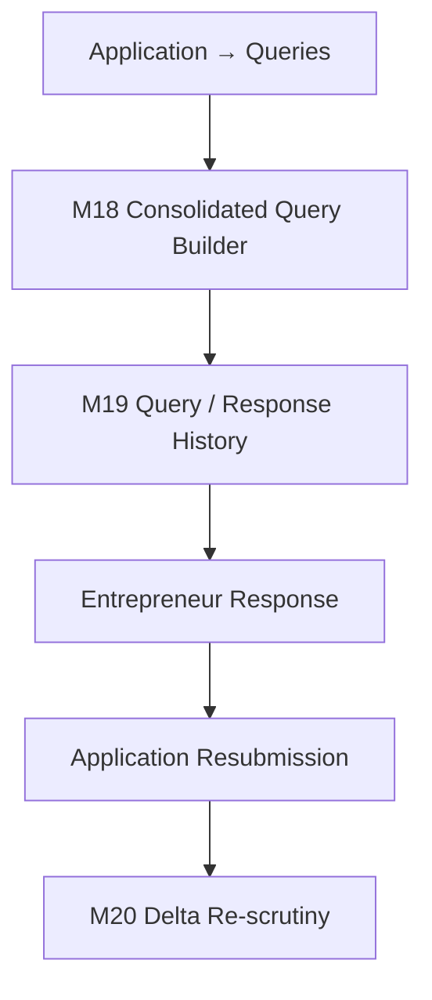

This is the canonical query loop.

## Important

Do NOT create:

```text
Queries → Scrutiny → Query
```

That creates a cycle.

Instead:

```text
Scrutiny
   ↓
Query
   ↓
Entrepreneur Response
   ↓
Resubmission
   ↓
Application
   ↓
Scrutiny / Delta
```

The application state changes, but navigation does not need to create a circular menu structure.

---

# 25. Inspection Queue

## Purpose

Find inspections requiring scheduling or operational action.

## Connection

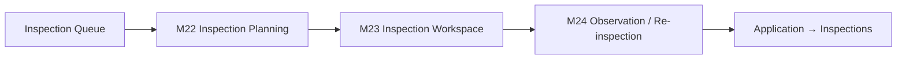

The Inspection Queue should not directly open scrutiny modules.

---

# 26. Application Workspace → Inspections

## Purpose

Application-specific inspection history and current inspection context.

## Connection

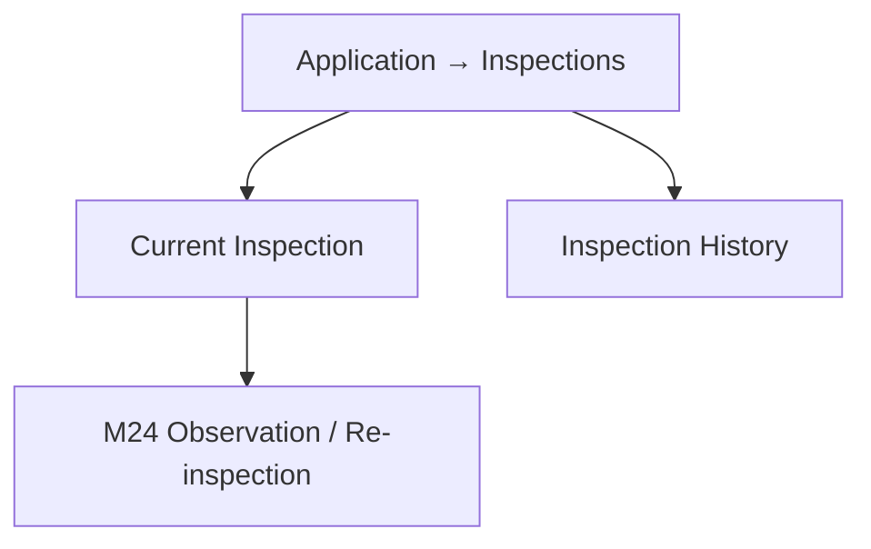

Operational scheduling remains in:

```text
Inspection Queue → M22
```

Execution remains in:

```text
M23 → M24
```

---

# 27. Inspections — Global Tab

## Purpose

Inspection records and history.

## What is present

- All inspections
- Scheduled
- Completed
- Observations
- Re-inspections

## Connection

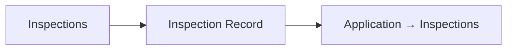

The global Inspections page is not another scheduling system.

Scheduling belongs to Inspection Queue.

---

# 28. Decisions — Global Tab

## Purpose

Decision queue and completed decision records.

## What is present

### Decision Pending

- Application
- Business
- Service
- Decision state
- Due date
- SLA
- Action

### Completed Decisions

- Application
- Business
- Decision
- Decision ID
- Date

## Connection

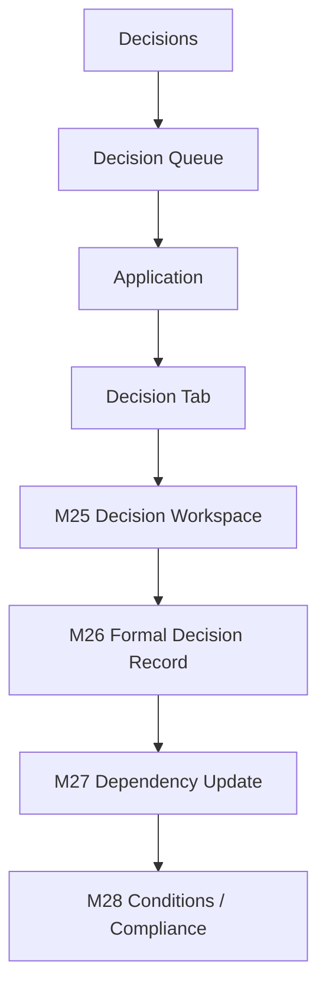

M27 and M28 are consequences of the decision.

They should NOT be equal top-level destinations on the Decisions landing page.

---

# 29. Application Workspace → Decision

## M25

Review the application record and make the statutory decision.

```text
Decision
   ↓
M25 Decision Workspace
```

## M26

Create/view the formal decision record.

```text
M25
 ↓
M26 Formal Decision Record
```

## M27

Show what the decision changes in the regulatory journey.

```text
M26
 ↓
M27 Dependency Update
```

## M28

Show configured conditions and compliance obligations.

```text
M27
 ↓
M28 Conditions / Compliance
```

There should be no route:

```text
M28 → M25
```

or:

```text
M27 → Decisions landing page → M25
```

That would create unnecessary cycles.

---

# 30. SLA & Escalations

## Purpose

Monitor configured SLA timelines and escalation conditions.

## Connection

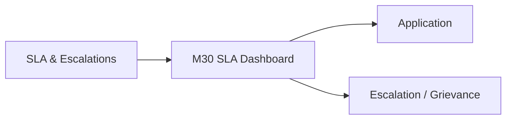

SLA does not directly open:

- M11
- M14
- M15
- M18
- M20
- M25

It opens the application or escalation context.

---

# 31. Grievances

## Purpose

Manage application-linked grievances and escalations.

## Connection

```mermaid
flowchart LR

    G[Grievances]
    G --> DETAIL[M31 Grievance Detail]
    DETAIL --> APP[Application]
```

The grievance detail can link to:

- SLA context
- Application timeline
- Query
- Inspection
- Decision

But those are contextual records, not new workflow routes.

---

# 32. Regulatory Assistant

## Purpose

Regulatory information retrieval and explanation.

## Connection

```mermaid
flowchart LR

    RAG[Regulatory Assistant]

    APP[Application Workspace] -. contextual entry .-> RAG
    REG[Regulatory Reference] -. contextual entry .-> RAG

    RAG --> SOURCE[Regulatory Source]
    SOURCE --> CHANGES[Regulatory Changes]
```

RAG should not directly open scrutiny, query or decision pages.

---

# 33. Analytics

## Purpose

Understand operational trends and process patterns.

## What is present

- Trend
- Funnel
- Queue Ageing
- Drill-down
- Process Flow
- Dependency View
- Bottleneck Analytics

## Connection

```mermaid
flowchart LR

    A[Analytics]
    A --> TREND[Trend]
    A --> FUNNEL[Funnel]
    A --> AGE[Queue Ageing]
    A --> DRILL[Drill-down]
    A --> BOTTLENECK[M36 Bottleneck Analytics]
```

Analytics can drill into an application for evidence.

It must not become another workflow entry point.

---

# 34. Regulatory Changes

## Purpose

Manage regulatory changes and versions.

## Connection

```mermaid
flowchart LR

    RC[M33 Regulatory Change Centre]
    RC --> DETAIL[Change Detail]
    DETAIL --> COMPARE[Version Compare]
    COMPARE --> IMPACT[M34 Regulatory Impact Analysis]
```

Impact Analysis can identify affected:

- Applications
- Approvals
- Renewals
- Compliance
- Documents
- Procedures
- Entrepreneur journeys
- Dependencies

---

# 35. Workload

## Purpose

Workload and capacity planning.

## Connection

```mermaid
flowchart LR

    W[Workload / Capacity]

    W --> SERVICE[Service View]
    W --> OFFICE[Office View]
    W --> DESK[Desk View]
    W --> AGE[Application Age]

    W --> SLA[SLA Dashboard]
    W --> IQ[Inspection Queue]
    W --> A[Analytics]
```

No direct route from Workload to service-specific scrutiny pages.

---

# 36. Audit / History

## Purpose

Historical record of actions, changes and workflow events.

## Connection

Audit is cross-cutting and read-only.

```mermaid
flowchart LR

    AUDIT[Audit / History]

    AUDIT -. history .-> APP[Application]
    AUDIT -. history .-> QUERY[Queries]
    AUDIT -. history .-> INS[Inspections]
    AUDIT -. history .-> DEC[Decisions]
    AUDIT -. history .-> DEP[Dependencies]
    AUDIT -. history .-> CHANGE[Regulatory Changes]
```

Audit should not send the officer into a new workflow.

---

# 37. Clean End-to-End Application Lifecycle

This is the actual application workflow.

```mermaid
flowchart TD

    SUBMITTED[Application Submitted]
    APP[Application Workspace]

    SUBMITTED --> APP

    APP --> PRE[M09 Automated Pre-check]
    PRE --> ROUTE[M10 Scrutiny Route]
    ROUTE --> SERVICE[Relevant Service Scrutiny]

    SERVICE --> CONS[M16 Cross-form Consistency]
    CONS --> DEP[M17 Dependencies]

    DEP --> QUERY[M18 Consolidated Query]
    QUERY --> RESPONSE[Entrepreneur Response]
    RESPONSE --> RESUB[Resubmission]
    RESUB --> DELTA[M20 Delta Re-scrutiny]

    DELTA --> SERVICE

    DEP --> INSREQ[Inspection Required]
    INSREQ --> PLAN[M22 Inspection Planning]
    PLAN --> INSPECT[M23 Inspection]
    INSPECT --> OBS[M24 Observation / Re-inspection]
    OBS --> DECISIONREADY[Return to Application Decision Flow]

    DEP --> DECISIONREADY
    DECISIONREADY --> M25[M25 Decision Workspace]
    M25 --> M26[M26 Formal Decision Record]
    M26 --> M27[M27 Dependency Update]
    M27 --> M28[M28 Conditions / Compliance]
```

This diagram describes the **business process**, while the earlier diagrams describe the **navigation structure**.

The two should not be confused.

---

# 38. Navigation vs Workflow

## Navigation

Navigation should be mostly directional:

```text
Global Work Area
      ↓
Application
      ↓
Application Tab
      ↓
Specific Page
```

## Workflow

The actual application lifecycle can move through:

```text
Pre-check
→ Scrutiny
→ Query
→ Response
→ Resubmission
→ Delta Review
→ Inspection
→ Decision
→ Dependency Update
→ Compliance
```

A workflow may return to an earlier **business process stage**, but the navigation system should not create unnecessary cyclic page links.

---

# 39. Explicit Redundant Connections To Remove

Remove all of the following:

```text
My Queue → M11
My Queue → M14
My Queue → M15

Applications → M11
Applications → M14
Applications → M15
Applications → M18
Applications → M20
Applications → M25

Service Catalogue → M11
Service Catalogue → M14
Service Catalogue → M15

Scrutiny global page → direct M11
Scrutiny global page → direct M14
Scrutiny global page → direct M15
Scrutiny global page → direct M18
Scrutiny global page → direct M20

Queries global page → direct M11
Queries global page → direct M14
Queries global page → direct M15

Inspection Queue → direct M11
Inspection Queue → direct M14
Inspection Queue → direct M15

Decisions → M27 as an independent equal workflow
Decisions → M28 as an independent equal workflow

M27 → Decisions landing page
M28 → Decisions landing page
M28 → M25

Analytics → M11
Analytics → M14
Analytics → M15

Workload → M11
Workload → M14
Workload → M15

Audit → any workflow execution page
```

---

# 40. Canonical Entry Points

Each deep page should have **one canonical place from which it is normally reached**.

| Page / Function                 | Canonical entry                                     |
| ------------------------------- | --------------------------------------------------- |
| M09 Automated Pre-check         | Application → Scrutiny                              |
| M10 Scrutiny Route              | Application → Scrutiny                              |
| M11 Land / Plot                 | Application → Scrutiny → Service Review             |
| M12 Parameter Detail            | Relevant Service Review                             |
| M13 Document Review             | Application → Documents                             |
| M14 Building / Planning         | Application → Scrutiny → Service Review             |
| M15 Water / Utility             | Application → Scrutiny → Service Review             |
| M16 Consistency                 | Application → Scrutiny                              |
| M17 Dependencies                | Application → Scrutiny / Dependencies               |
| M18 Query Builder               | Application → Queries                               |
| M19 Query History               | Application → Queries                               |
| M20 Delta Re-scrutiny           | Application → Scrutiny                              |
| M22 Inspection Planning         | Inspection Queue                                    |
| M23 Inspection Workspace        | Inspection Planning                                 |
| M24 Observation / Re-inspection | Inspection Workspace                                |
| M25 Decision Workspace          | Application → Decision                              |
| M26 Formal Decision Record      | Decision Workspace                                  |
| M27 Dependency Update           | Formal Decision Record                              |
| M28 Conditions / Compliance     | Dependency Update / Application → Decision          |
| M30 SLA Dashboard               | SLA & Escalations                                   |
| M31 Grievance Detail            | Grievances                                          |
| M32 Regulatory Assistant        | Regulatory Assistant / contextual Application entry |
| M33 Regulatory Change Centre    | Regulatory Changes                                  |
| M34 Impact Analysis             | Regulatory Change Centre                            |
| M35 Analytics                   | Analytics                                           |
| M36 Bottleneck Analytics        | Analytics                                           |
| M37 Workload                    | Workload                                            |
| M38 Audit                       | Audit / History                                     |

---

# 41. Final Simplified Mental Model

The officer should think:

```text
I need to FIND something
        ↓
Applications

I need to WORK on applications assigned to me
        ↓
My Queue

I need to WORK ON SCRUTINY
        ↓
Scrutiny
        ↓
Application
        ↓
Scrutiny tab

I need to WORK ON QUERIES
        ↓
Queries
        ↓
Application
        ↓
Queries tab

I need to WORK ON INSPECTIONS
        ↓
Inspection Queue / Inspections
        ↓
Application
        ↓
Inspections tab

I need to MAKE DECISIONS
        ↓
Decisions
        ↓
Application
        ↓
Decision tab

I need to CHECK SLA
        ↓
SLA & Escalations

I need to HANDLE GRIEVANCES
        ↓
Grievances

I need to UNDERSTAND REGULATIONS
        ↓
Regulatory Assistant

I need to UNDERSTAND OPERATIONS
        ↓
Analytics

I need to HANDLE REGULATORY CHANGES
        ↓
Regulatory Changes

I need to UNDERSTAND WORKLOAD
        ↓
Workload

I need to SEE WHAT HAPPENED
        ↓
Audit / History
```

---

# 42. One-Sentence Rule For The Figma Connection Prompt

When generating the actual Figma connection prompt, use this rule:

> **Connect each global sidebar tab only to its own work area; when an application is selected, open the shared Application Workspace; keep deep service-specific scrutiny, query, inspection, decision and compliance pages inside that Application Workspace; do not create duplicate shortcuts, cyclic navigation, or alternate routes to the same deep page.**
